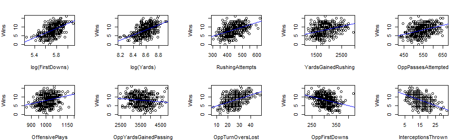
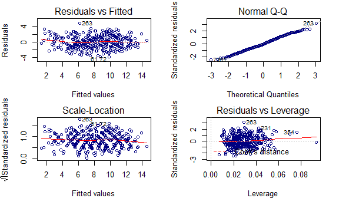

Football games prediction project

Authors: Kaixin Wang & Qin Hu

Time: Summer Session A 2019

Introduction
------------

In this regression competition project, the goal is to predict the numeric variable `Wins` from the `Football` dataset, which represents the number of football games that a team won during a season of 16 games.

Method and Model
----------------

1.  **Regression model**: The regression model that we decide to adopt is a Multiple Lienar Regression (MLR) model:

Reasons in the adopting MLR model:

-   Since the total number of predictors in the dataset is *p* = 31, which is relatively small and the total number of observations is *n* = 380, our first choice was to fit a MLR model.
-   Since MLR has higher interpretability than many other statistical learning methods, and since we are familiar with the predictors and the response to some degree, using a MLR model will help us in the process of variable selection and evaluating the model.
-   Some of the statistical learning methods (such as boosting and random forest) tend to overly fit the training set, and thus they don't have a high prediction accuracy on the testing sets.

2.  **Variable selection**: Based on the pairwise scatterplots based on `plot(Wins ~ predictors)`, we observe that there are several predictors that have a strong linear relationship with the response variable, for example:

Scatterplots of Wins vs. different predictor variables

Steps in the variable selection process:

1.  Based on the fact that a random forest classifier picks $\\frac{p}{3}$ predictors by default, where *p* = total number of predictors = 31 in the dataset, and the fact that there is diminishing amount of increase *R**adj* when adding more than 10 predictors, we chose to include 10 predictor variables.

2.  Transformation of variables: we transformed `Yards` and `FirstDowns` by applying the logarithmic function to bring down their scale, while keeping as much information of the variables as possible. The reason is because these two predictors are very important in predicting the response in the training set based on their high correlation with the response.

3.  By looking at the *pairwise scatterplots* and *correlation matrix* between the response and the predictors in the training set, and by comparing the *R**adj* and training RSS using different MLR models with 10 predictor variables, the model we selected is as the following:

`Wins ~ log(FirstDowns) + RushingAttempts + log(Yards) + YardsGainedRushing + OppPassesAttempted + OffensivePlays + OppYardsGainedPassing + OppTurnOversLost + OppFirstDowns + InterceptionsThrown`

<table>
<colgroup>
<col width="37%" />
<col width="16%" />
<col width="17%" />
<col width="13%" />
<col width="14%" />
</colgroup>
<thead>
<tr class="header">
<th align="center"> </th>
<th align="center">Estimate</th>
<th align="center">Std. Error</th>
<th align="center">t value</th>
<th align="center">Pr(&gt;|t|)</th>
</tr>
</thead>
<tbody>
<tr class="odd">
<td align="center"><strong>(Intercept)</strong></td>
<td align="center">-101</td>
<td align="center">8.763</td>
<td align="center">-11.52</td>
<td align="center">1.906e-26</td>
</tr>
<tr class="even">
<td align="center"><strong>log(FirstDowns)</strong></td>
<td align="center">9.539</td>
<td align="center">1.919</td>
<td align="center">4.971</td>
<td align="center">1.022e-06</td>
</tr>
<tr class="odd">
<td align="center"><strong>RushingAttempts</strong></td>
<td align="center">0.02328</td>
<td align="center">0.003784</td>
<td align="center">6.153</td>
<td align="center">1.981e-09</td>
</tr>
<tr class="even">
<td align="center"><strong>log(Yards)</strong></td>
<td align="center">8.307</td>
<td align="center">1.919</td>
<td align="center">4.329</td>
<td align="center">1.929e-05</td>
</tr>
<tr class="odd">
<td align="center"><strong>YardsGainedRushing</strong></td>
<td align="center">-0.0028</td>
<td align="center">0.0005276</td>
<td align="center">-5.307</td>
<td align="center">1.927e-07</td>
</tr>
<tr class="even">
<td align="center"><strong>OppPassesAttempted</strong></td>
<td align="center">0.02342</td>
<td align="center">0.00264</td>
<td align="center">8.871</td>
<td align="center">3.167e-17</td>
</tr>
<tr class="odd">
<td align="center"><strong>OffensivePlays</strong></td>
<td align="center">-0.02257</td>
<td align="center">0.002841</td>
<td align="center">-7.947</td>
<td align="center">2.347e-14</td>
</tr>
<tr class="even">
<td align="center"><strong>OppYardsGainedPassing</strong></td>
<td align="center">-0.001624</td>
<td align="center">0.000352</td>
<td align="center">-4.615</td>
<td align="center">5.44e-06</td>
</tr>
<tr class="odd">
<td align="center"><strong>OppTurnOversLost</strong></td>
<td align="center">0.1069</td>
<td align="center">0.01355</td>
<td align="center">7.89</td>
<td align="center">3.471e-14</td>
</tr>
<tr class="even">
<td align="center"><strong>OppFirstDowns</strong></td>
<td align="center">-0.02205</td>
<td align="center">0.004662</td>
<td align="center">-4.73</td>
<td align="center">3.201e-06</td>
</tr>
<tr class="odd">
<td align="center"><strong>InterceptionsThrown</strong></td>
<td align="center">-0.1299</td>
<td align="center">0.01882</td>
<td align="center">-6.902</td>
<td align="center">2.249e-11</td>
</tr>
</tbody>
</table>

<table style="width:86%;">
<caption>Final MLR model and model statistics</caption>
<colgroup>
<col width="20%" />
<col width="30%" />
<col width="12%" />
<col width="22%" />
</colgroup>
<thead>
<tr class="header">
<th align="center">Observations</th>
<th align="center">Residual Std. Error</th>
<th align="center"><em>R</em>2</th>
<th align="center">Adjusted <em>R</em>2</th>
</tr>
</thead>
<tbody>
<tr class="odd">
<td align="center">380</td>
<td align="center">1.552</td>
<td align="center">0.7616</td>
<td align="center">0.7552</td>
</tr>
</tbody>
</table>

Assumptions, Diagnostics and Results
------------------------------------

**Assumptions**

In the MLR model, *y**i* = *β*0 + *β*1*x**i*1 + ⋅ ⋅ ⋅ + *β**p**x**i**p* + *ϵ**i*, we assume that *ϵ**i* ∼ *N*(0, *σ*2) are independently distributed.

**Diagnostics**

Diagnostics of the MLR model

1.  From the residuals vs. fitted values plot, the errors are independently distributed and E\[*ϵ*\] = 0 (no pattern exists in the plot and the average of errors is around zero throughout).
2.  From the standardized residuals vs. fitted values plot, the constant variance assumption is satisfied (flat line representing the constant value of the variance).
3.  From the qq-plot, the normality assumption of error terms is satisfied (points follow the 45-degree straight line passing through the origin).

Conclusion and Discussion
-------------------------

1.  **Comparision between summary statistics of the training set and testing set predictions**:

<table style="width:72%;">
<caption>summary table of the training set predictions</caption>
<colgroup>
<col width="11%" />
<col width="13%" />
<col width="12%" />
<col width="11%" />
<col width="13%" />
<col width="9%" />
</colgroup>
<thead>
<tr class="header">
<th align="center">Min.</th>
<th align="center">1st Qu.</th>
<th align="center">Median</th>
<th align="center">Mean</th>
<th align="center">3rd Qu.</th>
<th align="center">Max.</th>
</tr>
</thead>
<tbody>
<tr class="odd">
<td align="center">1.352</td>
<td align="center">6.123</td>
<td align="center">8.26</td>
<td align="center">8.139</td>
<td align="center">10.3</td>
<td align="center">14.54</td>
</tr>
</tbody>
</table>

<table style="width:74%;">
<caption>summary table of the testing set predictions</caption>
<colgroup>
<col width="12%" />
<col width="13%" />
<col width="12%" />
<col width="11%" />
<col width="13%" />
<col width="9%" />
</colgroup>
<thead>
<tr class="header">
<th align="center">Min.</th>
<th align="center">1st Qu.</th>
<th align="center">Median</th>
<th align="center">Mean</th>
<th align="center">3rd Qu.</th>
<th align="center">Max.</th>
</tr>
</thead>
<tbody>
<tr class="odd">
<td align="center">0.7344</td>
<td align="center">5.922</td>
<td align="center">7.709</td>
<td align="center">7.544</td>
<td align="center">9.157</td>
<td align="center">13.45</td>
</tr>
</tbody>
</table>

Based on the two summary tables above, we observe that the predictions on the testing set in general are lower than the predictions on the training set.

1.  **Interpretations of the model**:

<!-- -->

(1).  Interpretations of the intercept:

Although the intercept (*β*0 = −101) is statistically significant, it doesn't make much sense in the real world: a team with no statistics collected or no games played during a season shouldn't have won a negative number of games, but rather the number should be around zero.

(2).  Interpretations of the slopes:

-   Predictor variables that increase the value of the response variable are `log(FirstDowns)`, `log(Yards)`, `RushingAttempts`, `OppPassesAttempted`, and `OppTurnOversLost`.

Based on the context, it is reasonable for variables such as `log(FirstDowns)` and `log(Yards)` to have an effect of increasing the response variable, since it is generally the case that the higher these numbers are, the better performance a team might have during a game.

-   Predictor variables that decrease the value of the response variable are `YardsGainedRushing`, `OppYardsGainedPassing`, `OffensivePlays`, `OppFirstDowns` and `InterceptionsThrown`.

Similarly, it also makes sense that predictors such as `OppYardsGainedPassing` and `OppFirstDowns` to have a negative effect on the value of the response, since these numbers represent the performance level of the opponent in a game.

(3).  **Possible improvements of the model**:

Due to the time limit, we only transformed two predictor variables by taking their logarithmic values. Further variable transformations should be taken into considertaion, such as taking the ratio of predictor variables to include more information into the model, while keeping the total number of predictors employed in the model small. For example, one possible new variable could be defined as $\\frac{\\text{FirstDowns}}{\\text{OppFirstDowns}}$, which represents the number of first downs of the team relavant to the number of first downs of the opponent.
