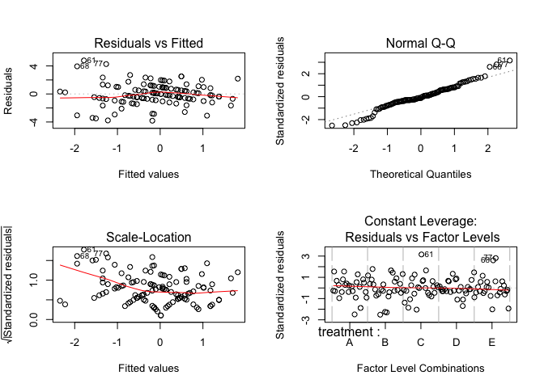

Music and Memory

Authors: Lizhou Fan, Kaixin Wang, Huizi Yu

Time: Statistics 101B - Spring 2019

Abstract
========

The United States has experienced considerable growth in its elder population in recent years. The number of older people is projected to increase by 135% between 2000 and 2050, and the population of people aged 85 and over is projected to increase by 350%. An ever growing aging population will pose strains on work force as well as existing health care. One common complication with aging is cognitive function loss, and studies have demonstrated an interest in battling such loss with non-medical treatments such as music. Thus, our study aims to determine whether listening to music (more specifically which type of music) have an effect on the performance of memory test for elders. We chose Latin Square in order to control for the variability in participants and the time memory test took place. We chose 25 male islanders, from `The Island`[1], aged 65 to 89 from the town Macondo to perform 5x5 Latin Square 5 times (each Latin Square contained 5 participants). Regarding the data gathering process, we first administer the "Memory Test Card" task, wait 5 minutes, then adminster the treatment (listening to 4 types of music or no music), wait 10 minutes for treatment to take effect, and then conduct the "Memory Test Card" again. The difference between two "Memory Test Card" scores are recorded. After data collection, we first analyzed the box plots for each individual Latin Square, then we created 6 ANOVA tables (5 for individual Latin Squares and 1 for the combined model). The results showed that music is statistically significant in 2 out of the 5 Latin Squares, but not significant in the overall model. Further research topics are also discussed.

Introduction
============

According to an annual report produced by the Administration for Community Living, about one in every seven Americans is over the age of 65 in 2017, and the proportion will swell to one in five by 2040. Aging is accompanied by declines in mental domains such as processing speed, reasoning, memory and executive functions (Ian J. Deary, 2009). As United States along with many other countries in the rest of world enters an aging society, there is a growing interest in identifying factors that can alleviate age-associated cognitive decline.

It has been suggested by some researches (Cirigliano, 2013; Michael, David, Gerald & Volker, 2014) that the temporal pattern structure in music can enhance cognition and memory retention. This effect appears to be especially significant for people with cognitive deterioration/impairment. Such theory has been put to practice by organizations such as *MUSIC AND MEMORY*, a non-profit that brings personalized music playlists to elders in nursing homes. They claim that "Music is the most 'fast-acting' non-drug approach to improving the lives of all persons with dementia, Parkinson’s, depression and other behavioral challenges" (2017 Impact Report, p.1).

Another interest of substantive researchers is the effect of different genre of music on memory and cognition. There is a considerable amount of publication dedicated to investigating the effect of Classical music on performance and memory retention. Rausher, Shaw and Ky (1993) found that listening to classical music improved intelligence and memory (the "Mozart Effect") and a British radio station specialised in western classical music was shown to help listeners relax and improve brain efficiency (Blanchard, 1979). Other studies compared different genres of music and concluded fast-paced music such as Rap and Heavy Metal may distract cognitive effects and lead to poorer performance (Dibben & Williamson, 2007; Smith & Morris, 1977).

Due to music’s accessibility as well as its universal presence, our study is interested in testing whether there is theoretical support for the uses of music as a means for memory improvement. We propose that listening to music will lead to a statistically significant increase in the memory test score. For this study, we apply four genres of music (Country, Classical, Dance, Heavy Metal) as treatment variables and a control variable (No Music). In this experiment, there are two goals. First, we want to test if music is a valid treatment for increasing memory performance; also, we want to find the best genre of music that leads to said improvement.

Methods
=======

Participants
------------

We chose the virtual participants from the online resource the Island. We found that female who age 65 or older are most susceptible to cognitive impairment and are outperformed by men (in the same age group) in fields of visuospatial, verbal processing, semantic and episodic memory (Laws, K. R. 2016). Because memory retention differs in individual (M. Karl Healey 2014), and in time of the day (A. D. Baddeley, 2007), we use Latin Square to block by individual subject and time of the day. In order to increase power as well as our error degrees of freedom, we repeated this 5\*5 Latin Square five times. This resulted in our necessary sample size of 25 participants. Moreover, studies have shown that cognitive impairment and dementia are are predicted to increase proportionately more in developing regions, thus indicating a potential association between the region of residence and cognitive performance (WHO, 2013). We decide to hold this factor constant and choose participants from the Town Macondo, where the population of senior citizens is the largest. In order to obtain the 25 participants, we went to the 64 neighbourhoods of Macondo and request consent from female participants age 65 to 89.

Design and Model
----------------

The Randomized Latin Square design is helpful when blocking two sources of variation, person to person variability and order (time) of treatment. Controlling these two factors, we would be more likely to detect a significant result of the effect of our treatment, type of music. Thus, we create a model accordingly:

*y**i**j**k* = *μ* + *α**i* + *β**j* + *γ**k* + *ϵ**i**j**k*,  *where* *i*, *j*, *k* = 1, 2, 3, 4, 5

In the model, *α* and *β* are the two blocking factors, while *γ* represents the treatment. Moreover, we held-constant three variables, including gender (male), region (the town of Macondo), and age (between 65 and 89).

We created a 5x5 Latin Square matrix with each treatment occurring once per row, and once per column. As the visualization below shows, these music and non-music treatments were each assigned a letter from A to E, i.e. No music (A), Classical Music (B), Country Music (C), Dance Music (D), and Heavy Metal Music (E).

  
                                                           
 

  Figure 1: Latin Square Design
  

                   
Then we created 5 replicates of the 5x5 Latin Square. To make a complete random Latin-square design, we implemented the random assignment method to shuffle the rows and columns. Using R, we assigned the numbers from 1 to 25 to the 25 participants and generated a random sequence (A) of number from 1 to 25 (`set.seed(100000)`). Then we generated a random sequence (B) of 1 to 5 (`set.seed(100000)`). We assigned the participants indexed with the first five number of sequence A to the Latin Square replicate indexed with the first number in sequence B and the next five in A to the second number in B, etc. Finally, we randomly permuted the columns, randomly permute the rows, and then assign the treatments to the Latin letters in a random fashion. We ensured each treatment occur once in each row and each column.

Instrument
----------

To conduct the study, we selected our participants from the Island to gather our sample on the open platform The Island. To measure music’s’ effects on memory of the simulated islanders on The Island, we used the different genres of music under the “Music” task to assign treatment at designated time and to record performance of “Memory Test Card”. Measurement errors were introduced and tolerated in the study as the time of measurement cannot be exact (e.g., 9 am sharp), i.e. we allowed small measuring errors since it would not have significant impact on our final result. As the data collection process of this project is highly collocative, we used Google Sheet to record data collected on the Island. For data analysis and data visualization, we used R and its related packages and worded on the IDE of RStudio.

Procedure
---------

For each Latin Square, we first measured the performance of “Memory Test Card”, then waited for 5 minutes. Then, we assigned treatments according to the randomized diagram; after the music treatment finishes, we waited 10 minutes before performing the second “Memory Test Card”. We replicated this process for all 5 Latin Squares and recorded the results into the Google Sheet.

Data Analysis
-------------

Using R, we conducted an ANOVA test on the data. We first loaded the data into R and used aov() function to analyze if there is any difference among the effects of different genre of music on memory retention among the 5 Latin Squares in the gathered data. In this process, we obtained the degrees of freedom, sum of squares and mean sum of squares for row and column blocks, the treatment, and their F and p-values in the summary tables. Finally, we conducted a Tukey HSD analysis to see how some certain variations by treatment predictor can be explained. The result data structure is shown below.

| ID  | treatment |  before|  after| time  |  difference|
|:----|:----------|-------:|------:|:------|-----------:|
| 1   | A         |      10|      9| 9:00  |          -1|
| 1   | E         |      10|      8| 12:00 |          -2|
| 1   | B         |       7|      9| 15:00 |           2|
| 1   | C         |       9|      9| 18:00 |           0|
| 1   | D         |       6|      7| 21:00 |           1|

Results
=======

Box Plots
---------

**Boxplot for each individual Latin Square:**

The median is represented by the black bar in the middle, where the “box” depicts the 1st and 3rd quantiles. Potential outliers are displayed as black circles.

  

  

Figure 2: Boxplot for each individual Latin Square

**Boxplot for all five Latin Squares combined:**

The median is represented by the black bar in the middle, where the “box” depicts the 1st and 3rd quantiles. Potential outliers are displayed as black circles.

Figure 3: Boxplot for all five Latin Squares

We began our exploratory data analysis by looking at the boxplots for each Latin Square and the boxplot for all five Latin Squares combined. We observe no significant difference in the mean of 5 music treatments in Latin square 2, 3 and 4. In Latin square 1 and 5, there appears to be a larger disparity between treatments. The boxplot for combined model showed no significant difference in mean for each treatment either. We proceed to ANOVA for further analysis.

Analysis of Variance (ANOVA)
----------------------------

We divided our analysis of variance (ANOVA) into two sections:

**Part 1: ANOVA of five individual Latin Squares:**

**Latin Square 1:**

<table style="width:83%;">
<caption>Analysis of Variance Table for Latin Square 1</caption>
<colgroup>
<col width="22%" />
<col width="6%" />
<col width="12%" />
<col width="13%" />
<col width="13%" />
<col width="13%" />
</colgroup>
<thead>
<tr class="header">
<th align="center"> </th>
<th align="center">Df</th>
<th align="center">Sum Sq</th>
<th align="center">Mean Sq</th>
<th align="center">F value</th>
<th align="center">Pr(&gt;F)</th>
</tr>
</thead>
<tbody>
<tr class="odd">
<td align="center"><strong>treatment</strong></td>
<td align="center">4</td>
<td align="center">20.56</td>
<td align="center">5.14</td>
<td align="center">8.965</td>
<td align="center">0.001365</td>
</tr>
<tr class="even">
<td align="center"><strong>ID</strong></td>
<td align="center">4</td>
<td align="center">8.56</td>
<td align="center">2.14</td>
<td align="center">3.733</td>
<td align="center">0.03387</td>
</tr>
<tr class="odd">
<td align="center"><strong>time</strong></td>
<td align="center">4</td>
<td align="center">12.56</td>
<td align="center">3.14</td>
<td align="center">5.477</td>
<td align="center">0.009582</td>
</tr>
<tr class="even">
<td align="center"><strong>Residuals</strong></td>
<td align="center">12</td>
<td align="center">6.88</td>
<td align="center">0.5733</td>
<td align="center">NA</td>
<td align="center">NA</td>
</tr>
</tbody>
</table>

**Latin Square 2:**

<table style="width:83%;">
<caption>Analysis of Variance Table for Latin Square 2</caption>
<colgroup>
<col width="22%" />
<col width="6%" />
<col width="12%" />
<col width="13%" />
<col width="13%" />
<col width="13%" />
</colgroup>
<thead>
<tr class="header">
<th align="center"> </th>
<th align="center">Df</th>
<th align="center">Sum Sq</th>
<th align="center">Mean Sq</th>
<th align="center">F value</th>
<th align="center">Pr(&gt;F)</th>
</tr>
</thead>
<tbody>
<tr class="odd">
<td align="center"><strong>treatment</strong></td>
<td align="center">4</td>
<td align="center">12.56</td>
<td align="center">3.14</td>
<td align="center">0.9691</td>
<td align="center">0.4596</td>
</tr>
<tr class="even">
<td align="center"><strong>ID</strong></td>
<td align="center">4</td>
<td align="center">6.56</td>
<td align="center">1.64</td>
<td align="center">0.5062</td>
<td align="center">0.7323</td>
</tr>
<tr class="odd">
<td align="center"><strong>time</strong></td>
<td align="center">4</td>
<td align="center">6.96</td>
<td align="center">1.74</td>
<td align="center">0.537</td>
<td align="center">0.7115</td>
</tr>
<tr class="even">
<td align="center"><strong>Residuals</strong></td>
<td align="center">12</td>
<td align="center">38.88</td>
<td align="center">3.24</td>
<td align="center">NA</td>
<td align="center">NA</td>
</tr>
</tbody>
</table>

**Latin Square 3:**

<table style="width:83%;">
<caption>Analysis of Variance Table for Latin Square 3</caption>
<colgroup>
<col width="22%" />
<col width="6%" />
<col width="12%" />
<col width="13%" />
<col width="13%" />
<col width="13%" />
</colgroup>
<thead>
<tr class="header">
<th align="center"> </th>
<th align="center">Df</th>
<th align="center">Sum Sq</th>
<th align="center">Mean Sq</th>
<th align="center">F value</th>
<th align="center">Pr(&gt;F)</th>
</tr>
</thead>
<tbody>
<tr class="odd">
<td align="center"><strong>treatment</strong></td>
<td align="center">4</td>
<td align="center">27.84</td>
<td align="center">6.96</td>
<td align="center">1.772</td>
<td align="center">0.1992</td>
</tr>
<tr class="even">
<td align="center"><strong>ID</strong></td>
<td align="center">4</td>
<td align="center">29.04</td>
<td align="center">7.26</td>
<td align="center">1.849</td>
<td align="center">0.1844</td>
</tr>
<tr class="odd">
<td align="center"><strong>time</strong></td>
<td align="center">4</td>
<td align="center">10.24</td>
<td align="center">2.56</td>
<td align="center">0.652</td>
<td align="center">0.6365</td>
</tr>
<tr class="even">
<td align="center"><strong>Residuals</strong></td>
<td align="center">12</td>
<td align="center">47.12</td>
<td align="center">3.927</td>
<td align="center">NA</td>
<td align="center">NA</td>
</tr>
</tbody>
</table>

**Latin Square 4:**

<table style="width:83%;">
<caption>Analysis of Variance Table for Latin Square 4</caption>
<colgroup>
<col width="22%" />
<col width="6%" />
<col width="12%" />
<col width="13%" />
<col width="13%" />
<col width="13%" />
</colgroup>
<thead>
<tr class="header">
<th align="center"> </th>
<th align="center">Df</th>
<th align="center">Sum Sq</th>
<th align="center">Mean Sq</th>
<th align="center">F value</th>
<th align="center">Pr(&gt;F)</th>
</tr>
</thead>
<tbody>
<tr class="odd">
<td align="center"><strong>treatment</strong></td>
<td align="center">4</td>
<td align="center">10.4</td>
<td align="center">2.6</td>
<td align="center">1.04</td>
<td align="center">0.4266</td>
</tr>
<tr class="even">
<td align="center"><strong>ID</strong></td>
<td align="center">4</td>
<td align="center">10.4</td>
<td align="center">2.6</td>
<td align="center">1.04</td>
<td align="center">0.4266</td>
</tr>
<tr class="odd">
<td align="center"><strong>time</strong></td>
<td align="center">4</td>
<td align="center">33.2</td>
<td align="center">8.3</td>
<td align="center">3.32</td>
<td align="center">0.0475</td>
</tr>
<tr class="even">
<td align="center"><strong>Residuals</strong></td>
<td align="center">12</td>
<td align="center">30</td>
<td align="center">2.5</td>
<td align="center">NA</td>
<td align="center">NA</td>
</tr>
</tbody>
</table>

**Latin Square 5:**

<table style="width:83%;">
<caption>Analysis of Variance Table for Latin Square 5</caption>
<colgroup>
<col width="22%" />
<col width="6%" />
<col width="12%" />
<col width="13%" />
<col width="13%" />
<col width="13%" />
</colgroup>
<thead>
<tr class="header">
<th align="center"> </th>
<th align="center">Df</th>
<th align="center">Sum Sq</th>
<th align="center">Mean Sq</th>
<th align="center">F value</th>
<th align="center">Pr(&gt;F)</th>
</tr>
</thead>
<tbody>
<tr class="odd">
<td align="center"><strong>treatment</strong></td>
<td align="center">4</td>
<td align="center">22.24</td>
<td align="center">5.56</td>
<td align="center">4.088</td>
<td align="center">0.02564</td>
</tr>
<tr class="even">
<td align="center"><strong>ID</strong></td>
<td align="center">4</td>
<td align="center">5.84</td>
<td align="center">1.46</td>
<td align="center">1.074</td>
<td align="center">0.4118</td>
</tr>
<tr class="odd">
<td align="center"><strong>time</strong></td>
<td align="center">4</td>
<td align="center">13.44</td>
<td align="center">3.36</td>
<td align="center">2.471</td>
<td align="center">0.1009</td>
</tr>
<tr class="even">
<td align="center"><strong>Residuals</strong></td>
<td align="center">12</td>
<td align="center">16.32</td>
<td align="center">1.36</td>
<td align="center">NA</td>
<td align="center">NA</td>
</tr>
</tbody>
</table>

**Part II: ANOVA for all five Latin Squares**:

<table style="width:83%;">
<caption>Analysis of Variance Table for five Latin Squares</caption>
<colgroup>
<col width="22%" />
<col width="6%" />
<col width="12%" />
<col width="13%" />
<col width="13%" />
<col width="13%" />
</colgroup>
<thead>
<tr class="header">
<th align="center"> </th>
<th align="center">Df</th>
<th align="center">Sum Sq</th>
<th align="center">Mean Sq</th>
<th align="center">F value</th>
<th align="center">Pr(&gt;F)</th>
</tr>
</thead>
<tbody>
<tr class="odd">
<td align="center"><strong>treatment</strong></td>
<td align="center">4</td>
<td align="center">15.95</td>
<td align="center">3.988</td>
<td align="center">1.277</td>
<td align="center">0.2849</td>
</tr>
<tr class="even">
<td align="center"><strong>ID</strong></td>
<td align="center">24</td>
<td align="center">70.83</td>
<td align="center">2.951</td>
<td align="center">0.9448</td>
<td align="center">0.5436</td>
</tr>
<tr class="odd">
<td align="center"><strong>time</strong></td>
<td align="center">4</td>
<td align="center">5.872</td>
<td align="center">1.468</td>
<td align="center">0.47</td>
<td align="center">0.7576</td>
</tr>
<tr class="even">
<td align="center"><strong>Residuals</strong></td>
<td align="center">92</td>
<td align="center">287.4</td>
<td align="center">3.124</td>
<td align="center">NA</td>
<td align="center">NA</td>
</tr>
</tbody>
</table>

The ANOVA tables show that treatment is not significant in Latin Squares 2,3,4. The p-values are 0.45, 0.459, 0.199 and 0.426 respectively, which are higher than the critical value of 0.05. Thus, we cannot conclude that there is a relationship between Music treatment and change in Memory Test performance. However, for Latin square 1 and 5, we can see significant p-values for treatment: 0.0012 and 0.02564. Next, we combine the five Latin Squares together to test the overall significance. Unfortunately, treatment was not significant in the combined model (p-value of 0.2849).

Multiple groups comparison
--------------------------

Figure 4: Multiple groups comparison on Latin Square 1 and 5

  

  
Finding treatment significant in Latin square 1 and 5, we proceed to conducting post-hoc TukeyHSD test to investigate which two music genres lead to statistically different changes in memory performance. From the plot for Latin Square 1, the two confidence intervals for pairwise comparison for "Country Music and Classical Music", and for "Heavy Metal Music and Classical Music” do not contain 0. This indicates that for Latin square 1, the mean of Country Music and Classical Music are statistically significant, as well as the mean of Heavy Metal Music and Classical Music. However, in Latin square 5, all pairwise comparison intervals contain 0. Thus, we conclude for Latin Square 5, none of the 5 treatment means are statistically different from each other.

Residual Diagnostics
--------------------

Figure 5: Diagnostics plots for model difference ~ treatment + ID + time

  

  
Based on the residuals vs. fitted values plot, there is no certain pattern in the graph, and the average value of error terms is mostly around zero. This indicates that the assumption of independent error terms with average value of zero is satisfied. Based on the normal QQ-plot, we observe that most of the data points are around the 45-degree line through the origin. This indicates that the assumption of normally distributed error terms is mostly satisfied. Based on the $\\sqrt{standardized\\ residuals}$ vs. fitted values plot, we observe that there is no obvious trend in the value of $\\sqrt{standardized\\ residuals}$. This indicates that the assumption of constant variance of error terms is also mostly satisfied.

Discussion
==========

Using a complete random 5 times 5 Latin-square design with 5 replicates, we collected data from 25 male islanders. After running our selected tests on them, we did a bunch of analysis accordingly. We used box-plot for exploration. Although there is no significant difference among the mean of 5 music treatments in Latin square 2,3 and 4, In Latin square 1 and 5, there seems to exist a larger disparity between treatments. Therefore, we further our study using ANOVA which demonstrated significant results of Latin square 1 and 5 and confirmed our finding in the explorative analysis.

The next step of our analysis, the multiple groups comparison, allowed us to further investigate which two music genres lead to statistically different changes in memory performance. As the line plots indicated, both the mean of Country Music and Classical Music and the mean of Heavy Metal Music and Classical Music are significantly effective on the change of memory test performance. Also, after checking the assumptions of our linear model of , we then conclude that our model, *y**i**j**k* = *μ* + *α**i* + *β**j* + *γ**k* + *ϵ**i**j**k*,  *w**h**e**r**e* *i*, *j*, *k* = 1, 2, 3, 4, 5, in which *α* and *β* are the two blocking factors and *γ* represents the treatment, is valid.

However, our results showed that there is limited evidence supporting music's significance in affecting memory test score. This coincides with the current controversial view on music's effectiveness in improving memory. There are a few drawbacks in our design that might compromise the results. The Latin Square design we employed does not assume interaction between the rows, columns and the treatment factor. However, it maybe possible that some individuals performed better in memory test at specific time of the day. Moreover, although literature supported that memory performance differs at different times of the day, it is not a significant blocking factor in our model. As a result, choosing another blocking factor may render treatment more significant. Another potential aspect that may influence our result is the islanders' ability to learn the Memory Test as the same test is repeated 5 times throughout the day.

Conclusion
==========

It is widely acknowledged that the memory problem, as one of the main mental domain issues, is related to human aging and cognitive function loss is a serious complication facing the aging US society. With a shrinking workforce as the elders are unable to perform routine tasks, the economy is likely suffer. Additional strains might be placed on the health care system. Through our research, we aim at testing the effectiveness of non-medical treatment, such as music of different genre, as mediators to age related memory loss. Our results attempt to support or refute the idea of using some certain genre of music as a potential non-medical treatment for memory loss problems for senior citizens.

To discuss the problem of our research and the possible further steps, we visualized the the age distribution of 25 senior male islanders that we sampled during the experiment. As the bar plot of the distribution shows, two points are clear. For age distribution, most of the senior male islanders have the age between 65 to 80 years old. Also, we primarily focus on the investigation of male.

Figure 6: Age distribution and results of the favorite music type survey

  

Since we are able to easily access the females on the island, we can choose to sample female senior islanders in the experiment. In further studies, we consider sample senior female islanders to investigate whether music has effects on memory for them. It would also be helpful to further investigate a larger range of age. It is important to notice that, we accept individual variances, as the latin-square design can handle them. To increase power, we would also like to repeat our experiment with more Latin Squares and more samples.

After conducting the experiment on the Island, we also sent out a post-experiment survey to the selected 25 islanders. The purpose of this survey is to see which type of music is the islander's favorite, among all four types of music (classical, country, dance and heavy metal music). The result of the survey is shown as below. For their favorite music types, most of the islanders sampled prefer listening to classical music, while a small portion of the islanders prefer country and dance music. One important observation is that none of the 25 islanders we sampled prefer listening to heavy metal music, which may be closely connected with results.

References
==========

Journal References
------------------

1.  [`Music And The Brain`](https://www.scientificamerican.com/article/music-and-the-brain-2006-09/), Norman M. Weinberger. *Scientific American*, September 1, 2006.
2.  [`Music Moves Brain to Pay Attention`](https://med.stanford.edu/news/all-news/2007/07/music-moves-brain-to-pay-attention-stanford-study-finds.html), Mitzi Baker. *Stanford Medicine News Center*, August 1, 2007.
3.  [`This is Your Brain on Music`](https://www.cnn.com/2013/04/15/health/brain-music-research/index.html), Elizabeth Landau. *CNN*, January 23, 2018.
4.  [`Music and health`](https://www.health.harvard.edu/staying-healthy/music-and-health), *Harvard Medical School*, July 2011.
5.  [`Individual Differences in Learning and Memory`](https://www.encyclopedia.com/psychology/encyclopedias-almanacs-transcripts-and-maps/individual-differences-learning-and-memory). *Encyclopedia*, 2014.

Publication References
----------------------

1.  [`A neuropsychological investigation of music, emotion, and autobiographical memory`](https://search.proquest.com/docview/1701283142?pq-origsite=summon&accountid=14512), Belfi, Amy Meredith. *University of Iowa*, 2015.
2.  [`Music in the brain: Differences between musicians and non-musicians`](https://search.proquest.com/docview/304910597?pq-origsite=summon&accountid=14512), Orlando, Julie. *University of Northern British Columbia (Canada)*, 2006.
3.  [`Music for the Mind: A Study Into Musical Preferences, Personality Traits and Memory Retention`](https://search.proquest.com/docview/2083960675?accountid=14512), Rogers, Rhiannon. *Western Sydney University (Australia)*, 2018.
4.  [`Music and cognitive abilities: A look at the Mozart Effect`](https://search.proquest.com/docview/305228684?pq-origsite=summon&accountid=14512), Bressler, Randy A. *The Chicago School of Professional Psychology*, 2003.
5.  [`Music and the Brain`](https://www.sciencedirect.com/science/article/pii/S1878875010001129), Edward R. Laws, Jr. *Harvard University*, 2010.
6.  [`The effect of music genre on a memory task`](https://scholar.utc.edu/cgi/viewcontent.cgi?article=1214&context=mps), Bugter, Darragh & Carden, Randy. *Trevecca Nazarene University*, 2012.
7.  [`Individual Differences in Memory Search and Their Relation to Intelligence`](http://memory.psych.upenn.edu/files/pubs/HealEtal14.pdf), M. Karl Healey. *University of Pennsylvania*, 2014.
8.  [`Memory and time of day`](https://journals.sagepub.com/doi/10.1080/14640747008401939), A. D. Baddeley, J. E. Hatter, Denise Scott & Aileen Snashall. *Quarterly Journal of Experimental Psychology*, 1970.
9.  [`The effect of music genre on a memory task`](https://scholar.utc.edu/mps/vol17/iss2/14), Bugter, Darragh and Carden, Randy. *Modern Psychological Studies, Vol. 17, No.2, Article 14*, 2012.
10. [`Music mnemonics aid Verbal Memory and Induce Learning – Related Brain Plasticity in Multiple Sclerosis`](https://www.frontiersin.org/articles/10.3389/fnhum.2014.00395/full), Thaut, Michael & Peterson, David & C McIntosh, Gerald & Hömberg, Volker. *Frontiers in human neuroscience*, 2014.
11. [`Key Components of the Mozart Effect`](https://journals.sagepub.com/doi/10.2466/pms.1998.86.3.835), Frances H. Rauscher & Gordon L. Shaw. *University of Wiscomin, Osbkosb* & *University of California, Irvine*, 1998.

[1] [`The Island: http://island.maths.uq.edu.au`](http://island.maths.uq.edu.au)
