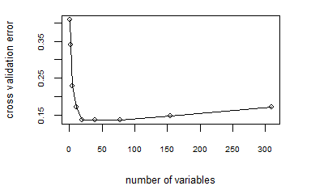
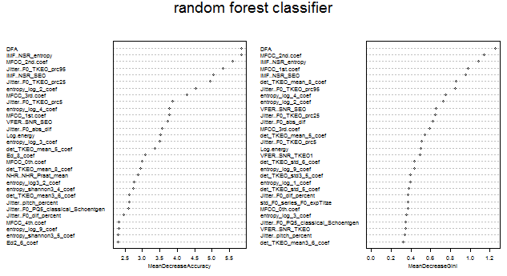

Parkinson's Disease Classification Project

Authors: Kaixin Wang, Qin Hu

Time: Summer Session A 2019

Introduction
------------

In this classification project, the goal is to label the response variable `category` as either 2 or 1, which represents whether a person has *Parkinson's disease* or not.

Assumptions
-----------

1.  In this high-dimensional dataset (*n* = 88 and *p* = 310), it is assumed that many predictors are highly correlated. This is verified by the fact that mutiple types of measurements were made on the same type of feature.
2.  To avoid using predictors that are highly correlated, we choose to build a random forest classifier to enforce using different subset of predictors when fitting the model.
3.  To generate relatively *unique* results using the random forest classifier, we set the seed to be a large odd number (a value greater than 5 × 104).

Method and Model
----------------

In building the random forest:

1.  Set a seed for reproducibility: `set.seed(56581)`.

2.  Determine the parameters of `randomForest()` by cross-validation:

10-fold cross validation in building a random forest

  

Based on the cross-validation error using 10-fold cross-validation, we obeserve that the cross-validation error is minimized when the number of variables used is around 18 to 19.

Therefore, we decide to use the default arguments of `randomForest()`, which has the parameter `ntree` = 500 and `mtry` = $\\sqrt{p}$, where *p* = 310 in this dataset (since $\\sqrt{311} \\approx 18$).

3.  Create a random forest using `randomForest()` with `formula` = `category ~ .`, `data` = `train` and `importance` = T.

Results
-------

1.  Confusion matrix on the training set:

|     |  1  |  2  |
|-----|:---:|:---:|
| 1   |  31 |  0  |
| 2   |  0  |  57 |

2.  Prediction of the test set:

<table style="width:14%;">
<caption>Prediction using random forest</caption>
<colgroup>
<col width="6%" />
<col width="6%" />
</colgroup>
<thead>
<tr class="header">
<th align="center">1</th>
<th align="center">2</th>
</tr>
</thead>
<tbody>
<tr class="odd">
<td align="center">10</td>
<td align="center">28</td>
</tr>
</tbody>
</table>
  

3.  Importance of the predictors ranked by the random forest classifier:

Importance of predictors determined by random forest

  

The two graphs plotted above showed the top thirty most important predictors in classifying the label in the training set, using the mean decrease accuracy (left) and the mean decrease Gini (right) as the ranking metric.

Conclusion and Discussion
-------------------------

1.  Based on the confusion matrix on the training set, we observe that the training error is exactly zero. This shows that the random forest model is potentially overfitting the training set. One possible reason for this is that we choose to the use the default argument `ntree` = 500, which makes the classifier highly flexible.

2.  Based on the summary table of predictions on the testing set, we observe that the representation rate of class 2 (has the disease) is almost three times as large as that of class 1 (no disease).

3.  Since the random forest model has a tendency to overfit the true model, further investigation can be given to select certain predictors from the top thirty predictors listed in the plots of the previous section. After selecting the most important predictors and deciding on the total number of predictors to use, the next step could be fitting a logistic regression classifier or Support Vector Machine classifier using only this subset of predictors to alleviate the problem of overfitting.
