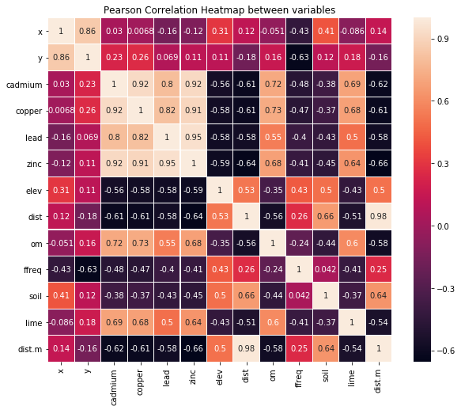
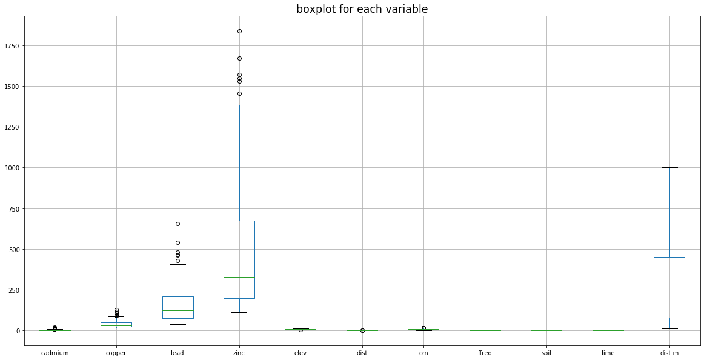

### OSCR Machine Learning in Python

**Linear Regression Module**

**&copy; Kaixin Wang**, Fall 2019


Module/Package import


```python
import numpy as np # numpy module for linear algebra
import pandas as pd # pandas module for data manipulation
import matplotlib.pyplot as plt # module for plotting
import seaborn as sns # another module for plotting
```


```python
import warnings # to handle warning messages
warnings.filterwarnings('ignore')
```


```python
from sklearn.linear_model import LinearRegression # package for linear model
import statsmodels.api as sm # another package for linear model
import statsmodels.formula.api as smf
import scipy as sp
```


```python
from sklearn.model_selection import train_test_split # split data into training and testing sets
```

Dataset import

The dataset that we will be using is the `meuse` dataset.

As described by the author of the data: "This data set gives locations and topsoil heavy metal concentrations, along with a number of soil and landscape variables at the observation locations, collected in a flood plain of the river Meuse, near the village of Stein (NL). Heavy metal concentrations are from composite samples of an area of approximately 15 m $\times$ 15 m."


```python
soil = pd.read_csv("soil.csv")  # data import
soil.head() # check if read in correctly
```


<div>
<style scoped>
    .dataframe tbody tr th:only-of-type {
        vertical-align: middle;
    }

    .dataframe tbody tr th {
        vertical-align: top;
    }

    .dataframe thead th {
        text-align: right;
    }
</style>
<table border="1" class="dataframe">
  <thead>
    <tr style="text-align: right;">
      <th></th>
      <th>x</th>
      <th>y</th>
      <th>cadmium</th>
      <th>copper</th>
      <th>lead</th>
      <th>zinc</th>
      <th>elev</th>
      <th>dist</th>
      <th>om</th>
      <th>ffreq</th>
      <th>soil</th>
      <th>lime</th>
      <th>landuse</th>
      <th>dist.m</th>
    </tr>
  </thead>
  <tbody>
    <tr>
      <th>0</th>
      <td>181072</td>
      <td>333611</td>
      <td>11.7</td>
      <td>85</td>
      <td>299</td>
      <td>1022</td>
      <td>7.909</td>
      <td>0.001358</td>
      <td>13.6</td>
      <td>1</td>
      <td>1</td>
      <td>1</td>
      <td>Ah</td>
      <td>50</td>
    </tr>
    <tr>
      <th>1</th>
      <td>181025</td>
      <td>333558</td>
      <td>8.6</td>
      <td>81</td>
      <td>277</td>
      <td>1141</td>
      <td>6.983</td>
      <td>0.012224</td>
      <td>14.0</td>
      <td>1</td>
      <td>1</td>
      <td>1</td>
      <td>Ah</td>
      <td>30</td>
    </tr>
    <tr>
      <th>2</th>
      <td>181165</td>
      <td>333537</td>
      <td>6.5</td>
      <td>68</td>
      <td>199</td>
      <td>640</td>
      <td>7.800</td>
      <td>0.103029</td>
      <td>13.0</td>
      <td>1</td>
      <td>1</td>
      <td>1</td>
      <td>Ah</td>
      <td>150</td>
    </tr>
    <tr>
      <th>3</th>
      <td>181298</td>
      <td>333484</td>
      <td>2.6</td>
      <td>81</td>
      <td>116</td>
      <td>257</td>
      <td>7.655</td>
      <td>0.190094</td>
      <td>8.0</td>
      <td>1</td>
      <td>2</td>
      <td>0</td>
      <td>Ga</td>
      <td>270</td>
    </tr>
    <tr>
      <th>4</th>
      <td>181307</td>
      <td>333330</td>
      <td>2.8</td>
      <td>48</td>
      <td>117</td>
      <td>269</td>
      <td>7.480</td>
      <td>0.277090</td>
      <td>8.7</td>
      <td>1</td>
      <td>2</td>
      <td>0</td>
      <td>Ah</td>
      <td>380</td>
    </tr>
  </tbody>
</table>
</div>


```python
soil.shape # rows x columns
```


    (155, 14)


```python
print(soil.describe())
```

                       x              y     cadmium      copper        lead  \
    count     155.000000     155.000000  155.000000  155.000000  155.000000   
    mean   180004.600000  331634.935484    3.245806   40.316129  153.361290   
    std       746.039775    1047.746801    3.523746   23.680436  111.320054   
    min    178605.000000  329714.000000    0.200000   14.000000   37.000000   
    25%    179371.000000  330762.000000    0.800000   23.000000   72.500000   
    50%    179991.000000  331633.000000    2.100000   31.000000  123.000000   
    75%    180629.500000  332463.000000    3.850000   49.500000  207.000000   
    max    181390.000000  333611.000000   18.100000  128.000000  654.000000   
    
                  zinc        elev        dist          om       ffreq  \
    count   155.000000  155.000000  155.000000  153.000000  155.000000   
    mean    469.716129    8.165394    0.240017    7.478431    1.606452   
    std     367.073788    1.058657    0.197702    3.432966    0.734111   
    min     113.000000    5.180000    0.000000    1.000000    1.000000   
    25%     198.000000    7.546000    0.075687    5.300000    1.000000   
    50%     326.000000    8.180000    0.211843    6.900000    1.000000   
    75%     674.500000    8.955000    0.364067    9.000000    2.000000   
    max    1839.000000   10.520000    0.880389   17.000000    3.000000   
    
                 soil        lime       dist.m  
    count  155.000000  155.000000   155.000000  
    mean     1.451613    0.283871   290.322581  
    std      0.636483    0.452336   226.799927  
    min      1.000000    0.000000    10.000000  
    25%      1.000000    0.000000    80.000000  
    50%      1.000000    0.000000   270.000000  
    75%      2.000000    1.000000   450.000000  
    max      3.000000    1.000000  1000.000000  
    


```python
index = pd.isnull(soil).any(axis = 1)
soil = soil[-index]
soil = soil.reset_index(drop = True)
```


```python
soil.shape
```


    (152, 14)


```python
n = soil.shape[1]
```

#### Exploratory Data Analysis (EDA)

    1. Correlation Heatmap


```python
plt.figure(figsize = (10, 8))
sns.heatmap(soil.corr(), annot = True, square = True, linewidths = 0.1)
plt.ylim(n-1, 0)
plt.xlim(0, n-1)
plt.title("Pearson Correlation Heatmap between variables")
plt.show()
```





```python
plt.figure(figsize = (10, 8))
corr = soil.corr()
mask = np.zeros_like(corr)
mask[np.triu_indices_from(mask)] = True
with sns.axes_style("white"):
    sns.heatmap(corr, mask = mask, linewidths = 0.1, vmax = .3, square = True)
plt.ylim(n-1, 0)
plt.xlim(0, n-1)
plt.title("correlation heatmap without symmetric information")
plt.show()
```


```python
fig, axs = plt.subplots(figsize = (8, 12))
plt.subplots_adjust(left=0, bottom=0, right=1, top=1, wspace=0, hspace=0.2)
plt.subplot(2, 1, 1)
# correlation heatmap without annotation
sns.heatmap(soil.corr(), linewidths = 0.1, square = True, cmap = "YlGnBu")
plt.ylim(n-1, 0)
plt.xlim(0, n-1)
plt.title("correlation heatmap without annotation")
plt.subplot(2, 1, 2)
# correlation heatmap with annotation
sns.heatmap(soil.corr(), linewidths = 0.1, square = True, annot = True, cmap = "YlGnBu")
plt.ylim(n-1, 0)
plt.xlim(0, n-1)
plt.title("correlation heatmap with annotation")
plt.show()
```


     2. Boxplots


```python
plt.figure(figsize = (20, 10))
soil.iloc[:, 2:].boxplot()
# soil.iloc[:, 2:].plot(kind = "box")  # 2nd method
plt.title("boxplot for each variable", fontsize = "xx-large")
plt.show()
```





```python
fig, axs = plt.subplots(2, int(n/2), figsize = (20, 10))
colors = ['b', 'g', 'r', 'c', 'm', 'y', 'pink']  # to set color

for i, var in enumerate(soil.columns.values):
    if var == "landuse":
        axs[1, i-int(n/2)].set_xlabel(var, fontsize = 'large')
        continue
    if i < int(n/2):
        axs[0, i].boxplot(soil[var])
        axs[0, i].set_xlabel(var, fontsize = 'large')
        axs[0, i].scatter(x = np.tile(1, soil.shape[0]), y = soil[var], color = colors[i])
    else:
        axs[1, i-int(n/2)].boxplot(soil[var])
        axs[1, i-int(n/2)].set_xlabel(var, fontsize = 'large')
        axs[1, i-int(n/2)].scatter(x = np.tile(1, soil.shape[0]), y = soil[var], 
                                   color = colors[i-int(n/2)])
        
plt.suptitle("boxplot of variables", fontsize = 'xx-large')
plt.show()
```


    3. scatterplots


```python
fig, axs = plt.subplots(2, int(n/2), figsize = (20, 10))
colors = ['b', 'g', 'r', 'c', 'm', 'y', 'k']  # to set color

for i, var in enumerate(soil.columns.values):
    if var == "landuse":
        axs[1, i-int(n/2)].set_xlabel(var, fontsize = 'large')
        continue
    if i < int(n/2):
        axs[0, i].scatter(soil[var], soil["lead"], color = colors[i])
        axs[0, i].set_xlabel(var, fontsize = 'large')
    else:
        axs[1, i-int(n/2)].scatter(soil[var], soil["lead"], color = colors[i-int(n/2)])
        axs[1, i-int(n/2)].set_xlabel(var, fontsize = 'large')
        
plt.suptitle("scatterplot of lead vs. predictors", fontsize = 'xx-large')
plt.show()
```


    4. histograms and density plots


```python
fig, axs = plt.subplots(2, int(n/2), figsize = (20, 10))
colors = ['b', 'g', 'r', 'c', 'm', 'y', 'pink']  # to set color

for i, var in enumerate(soil.columns.values):
    if var == "landuse":
        axs[1, i-int(n/2)].set_xlabel(var, fontsize = 'large')
        continue
    if i < int(n/2):
        sns.distplot(soil[var], color = colors[i], ax = axs[0, i])
    else:
        sns.distplot(soil[var], color = colors[i-int(n/2)], ax = axs[1, i-int(n/2)])
        
plt.suptitle("histogram and density plot of each variable", fontsize = 'xx-large')
plt.show()
```


Variable Selection and Modeling

Based on the scatterplot of lead vs. predictors:
    
- `cadmium`, `copper`, `zinc` and `om` seem to have strong **positive** correlation with lead
- `elev`, `dist` and `dist.m` seem to have strong **negative** correlation with lead
- categorical variable `lime` seems to be a good indicator predictor variable

Therefore, we now build a linear model using 6 predictors: `cadmium`, `copper`, `zinc`, `elev`, `dist` and `lime`.


```python
# variables = ["cadmium", "copper", "zinc", "elev", "dist", "dist.m", "lime"]
variables = ["cadmium", "copper", "zinc", "elev", "dist",  "lime"]
```


```python
x = soil[variables]
y = soil["lead"]
```

#### Modeling - building a linear model

split the dataset into training and testing set


```python
X_train, X_test, y_train, y_test = train_test_split(x, y, test_size = 0.33, random_state = 42)
```

build a linear model using `sklearn` package


```python
model = LinearRegression().fit(X_train, y_train)
```


```python
# R^2 on training set
R2_train = model.score(X_train, y_train)
R2_train
```


    0.9483947080189404


```python
# R^2 on testing set
R2_test = model.score(X_test, y_test)
R2_test
```


    0.964901551899052


```python
# value of intercepts
for var, coef in zip(variables, model.coef_):
    print(var, coef)
```

    cadmium -13.391990002100986
    copper 0.05365863276389149
    zinc 0.42346584485869393
    elev -3.2531127698493183
    dist 14.509965024252311
    lime -23.514058405476963
    

build a linear model using `statsmodel` package


```python
df_train = pd.concat([X_train, y_train], axis = 1) # build a dataframe for training set
```


```python
model_smf = smf.ols("lead ~ cadmium + copper + zinc + elev + lime", data = df_train)
```


```python
results = model_smf.fit()
print(results.summary())
```

                                OLS Regression Results                            
    ==============================================================================
    Dep. Variable:                   lead   R-squared:                       0.948
    Model:                            OLS   Adj. R-squared:                  0.945
    Method:                 Least Squares   F-statistic:                     346.6
    Date:                Tue, 29 Oct 2019   Prob (F-statistic):           2.35e-59
    Time:                        09:18:05   Log-Likelihood:                -467.76
    No. Observations:                 101   AIC:                             947.5
    Df Residuals:                      95   BIC:                             963.2
    Df Model:                           5                                         
    Covariance Type:            nonrobust                                         
    ==============================================================================
                     coef    std err          t      P>|t|      [0.025      0.975]
    ------------------------------------------------------------------------------
    Intercept     23.8739     27.200      0.878      0.382     -30.126      77.874
    cadmium      -13.2322      2.240     -5.908      0.000     -17.679      -8.785
    copper         0.0522      0.278      0.187      0.852      -0.500       0.605
    zinc           0.4188      0.020     20.756      0.000       0.379       0.459
    elev          -2.4719      2.895     -0.854      0.395      -8.220       3.276
    lime         -24.7610      7.775     -3.185      0.002     -40.196      -9.326
    ==============================================================================
    Omnibus:                        2.077   Durbin-Watson:                   1.947
    Prob(Omnibus):                  0.354   Jarque-Bera (JB):                1.494
    Skew:                          -0.246   Prob(JB):                        0.474
    Kurtosis:                       3.336   Cond. No.                     6.42e+03
    ==============================================================================
    
    Warnings:
    [1] Standard Errors assume that the covariance matrix of the errors is correctly specified.
    [2] The condition number is large, 6.42e+03. This might indicate that there are
    strong multicollinearity or other numerical problems.
    

diagnostics plots


```python
# diagnosticsPlots function definition
def diagnosticsPlots(predictions, truevalues):
    '''
    This function will plot the following two diagonistics plots:
    1. residuals vs. fitted values plot (plot on the left)
    2. qqplot of the residuals (plot on the right)
    
    parameters required:
    - predictions: predicted values using the linear regression model
    - truevalues:  true values of the response variable
    
    required modules/packages:
    - matplotlib.pyplot (plt)
    - scipy (sp)
    
    Author: Kaixin Wang
    Created: October 2019
    '''
    residuals = truevalues - predictions
    fig, axs = plt.subplots(figsize = (12, 2.5))
    plt.subplot(1, 2, 1)
    # residuals vs. fitted values
    plt.scatter(predictions, residuals)
    plt.plot(predictions, np.tile(np.mean(residuals), residuals.shape[0]), "r-")
    plt.xlim([np.min(predictions) - 2.5, np.max(predictions) + 2.5])
    plt.title("residuals vs. fitted values")
    plt.ylabel("residuals")
    plt.xlabel("fitted values")
    plt.legend(["E[residuals]"])
    print("Average of residuals: ", np.mean(residuals))
    # qqplot
    plot = plt.subplot(1, 2, 2)
    sp.stats.probplot(residuals, plot = plot, fit = True)
    plt.show()
```


```python
pred_val = results.fittedvalues.copy()
true_val = y_train.copy()
diagnosticsPlots(pred_val, true_val)
```

    Average of residuals:  -9.60639708594472e-13
    


training and testing Root-Mean-Square Error (RMSE)

The root-mean-square error of a prediction is calcuated as the following:

$$\text{RMSE} = \frac{\sqrt{\sum_{i=1}^n (y_i - \hat {y_i}) ^ 2}}{n}$$

where $y_i$ is the true value of the response, $\hat {y_i}$ is the fitted value of the response, n is the size of the input


```python
def RMSETable(train_y, train_fitted, train_size, train_R2, test_y, test_fitted, test_size, test_R2):
    '''
    This function creates a function that returns a dataframe in the following format:
    -------------------------------------------------
                     RMSE     R-squared    size 
    training set  train_RMSE  train_R2    n_training
    testing set   test_RMSE   tesint_R2   n_testing
    -------------------------------------------------
    
    parameters required:
    - train_y: true values of the response in the training set
    - train_fitted: fitted values of the response in the training set
    - train_size: size of the training set
    - train_R2: R-squared on the training set
    - test_y: true values of the response in the testing set
    - test_fitted: fitted values of the response in the testing set
    - test_size: size of the testing size
    - test_R2: R-squared on the testing set
    
    Author: Kaixin Wang
    Created: October 2019
    '''
    train_RMSE = np.sqrt(sum(np.power(train_y - train_fitted, 2))) / train_size
    test_RMSE  = np.sqrt(sum(np.power(test_y  - test_fitted, 2))) / test_size
    train = [train_RMSE, train_size, train_R2]
    test  = [test_RMSE,  test_size,  test_R2]
    return pd.DataFrame([train, test], index = ["training set", "testing set"], columns = ["RMSE", "R-squared", "size"])
```


```python
table1 = RMSETable(y_train.values, model.predict(X_train), R2_train, len(y_train), 
                   y_test.values, model.predict(X_test), R2_test, len(y_test))
print(table1)
```

                        RMSE  R-squared  size
    training set  262.286912   0.948395   101
    testing set   159.247070   0.964902    51
    

#### Model selection

Since we are using 5 predictor variables for 152 entries, we can consider using fewer predictors to improve the $R_{adj}^2$, where is a version of $R^2$ that penalizes model complexity.

Selecting fewer predictor will also help with preventing overfitting.

Therefore, observing that `zinc`, `copper` and `cadmium` have relatively stronger correlation with `lead`, we now build a model using only these three predictors.

using `sklearn` linear regression module


```python
variables = ["cadmium", "copper", "zinc"]
x = soil[variables]
y = soil["lead"]
X_train, X_test, y_train, y_test = train_test_split(x, y, test_size = 0.33, random_state = 42)
```


```python
model2 = LinearRegression().fit(X_train, y_train)
# R^2 on training set
R2_train = model2.score(X_train, y_train)
print("Training set R-squared", R2_train)
# R^2 on testing set
R2_test = model2.score(X_test, y_test)
print("Testing set R-squared", R2_test)
```

    Training set R-squared 0.9424059338188308
    Testing set R-squared 0.954472865577916
    


```python
# value of intercepts
for var, coef in zip(variables, model2.coef_):
    print(var, coef)
```

    cadmium -14.916823671628372
    copper -0.041805969322452396
    zinc 0.4249074981904297
    

using `statsmodel` ordinary linear regrssion module


```python
df_train = pd.concat([X_train, y_train], axis = 1) # build a dataframe for training set
model_smf = smf.ols("lead ~ cadmium + copper + zinc", data = df_train)
results = model_smf.fit()
print(results.summary())
```

                                OLS Regression Results                            
    ==============================================================================
    Dep. Variable:                   lead   R-squared:                       0.942
    Model:                            OLS   Adj. R-squared:                  0.941
    Method:                 Least Squares   F-statistic:                     529.1
    Date:                Tue, 29 Oct 2019   Prob (F-statistic):           5.81e-60
    Time:                        09:18:06   Log-Likelihood:                -472.96
    No. Observations:                 101   AIC:                             953.9
    Df Residuals:                      97   BIC:                             964.4
    Df Model:                           3                                         
    Covariance Type:            nonrobust                                         
    ==============================================================================
                     coef    std err          t      P>|t|      [0.025      0.975]
    ------------------------------------------------------------------------------
    Intercept      3.0363      6.989      0.434      0.665     -10.836      16.908
    cadmium      -14.9168      2.268     -6.576      0.000     -19.419     -10.415
    copper        -0.0418      0.286     -0.146      0.884      -0.609       0.526
    zinc           0.4249      0.021     20.632      0.000       0.384       0.466
    ==============================================================================
    Omnibus:                        4.128   Durbin-Watson:                   1.911
    Prob(Omnibus):                  0.127   Jarque-Bera (JB):                3.989
    Skew:                          -0.258   Prob(JB):                        0.136
    Kurtosis:                       3.825   Cond. No.                     1.61e+03
    ==============================================================================
    
    Warnings:
    [1] Standard Errors assume that the covariance matrix of the errors is correctly specified.
    [2] The condition number is large, 1.61e+03. This might indicate that there are
    strong multicollinearity or other numerical problems.
    

diagnostics plots


```python
pred_val = results.fittedvalues.copy()
true_val = y_train.copy()
diagnosticsPlots(pred_val, true_val)
```

    Average of residuals:  -1.3502422502419408e-12
    


```python
table2 = RMSETable(y_train.values, model2.predict(X_train), R2_train, len(y_train), 
                   y_test.values, model2.predict(X_test), R2_test, len(y_test))
print(table2)
```

                        RMSE  R-squared  size
    training set  278.849250   0.942406   101
    testing set   183.350488   0.954473    51
    

#### model evaluation and comparison

- model with 5 predictors (full model)


```python
print(table1)
```

                        RMSE  R-squared  size
    training set  262.286912   0.948395   101
    testing set   159.247070   0.964902    51
    

- model with 3 predictors (reduced model)


```python
print(table2)
```

                        RMSE  R-squared  size
    training set  278.849250   0.942406   101
    testing set   183.350488   0.954473    51
    

Comparing the tables obtained above:

- The full model with 6 predictors has lower test RMSE and higher $R^2$ value than the reduced model with 3 predictors 
- However, a higher $R^2$ doesn't mean that we favor the full model, since $R^2$ will always increase as the number of predictors used increases. Instead, we will take a look at $R^2_{adj}$, the adjusted $R^2$, which is calculated as 

$$R^2_{adj} = 1 - (1 - R^2) \frac{n - 1}{n - p - 1}$$

where $n$ is the sample size and $p$ is the number of predictors used in the model.

Since $R_{adj}^2$ of the full model is 0.945, while the $R_{adj}^2$ of the reduced model is 0.941, we observe that the model doens't obtain very much improvement by adding three additional predictors.

#### Summary of the module

By building two linear regression models using 6 and 3 predictors respectively, we observe that predictor variables `cadmium`, `copper` and `zinc` have very strong positive correlation with the response variable `lead`. In addition, we also observed that by adding three more predictors, `dist`, `elev` and `lime`, the $R^2_{adj}$ didn't get much improvement comparing to the model with only 3 predictors.

Therefore, the final model that we decided to adopt is the reduced model with 3 predictors:

$$\text{Lead} \sim \text{Cadmium} + \text{Copper} + \text{Zinc}$$

Reference:

Dataset: `meuse` dataset

- P.A. Burrough, R.A. McDonnell, 1998. Principles of Geographical Information Systems. Oxford University Press.
- Stichting voor Bodemkartering (STIBOKA), 1970. Bodemkaart van Nederland : Blad 59 Peer, Blad 60 West en 60 Oost Sittard: schaal 1 : 50 000. Wageningen, STIBOKA.

To access this dataset in `R`:

```
install.packages("sp")
library(sp)
data(meuse)
```

**&copy; Kaixin Wang**, updated October 2019
