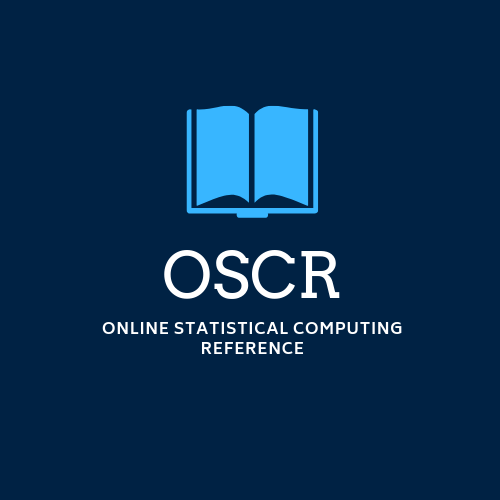

Online Statistical Computing Reference

Team contributors: Lizhou Fan, Kaixin Wang, Huizi Yu

Introduction
============

Online Statistical Computing Reference (OSCR) is an online statistical learning platform that students in social sciences could refer to. It is an online cookbook for learning data science in a non-statistical context.

    
                                                           
 

  Figure 1: Logo of OSCR
  

The main website of OSCR is publicly available at <https://oscrproject.wixsite.com/website>.

Our team currently consists of three students from the Department of Statistics at UCLA.

Languages
=========

Languages that we are currently building are:

-   main languages:

    -   R
    -   Python

-   other languages frequently used in data analysis:

    -   Excel
    -   SQL
    -   Tableau
    -   Open Refine, Voyant Tools

Components
==========

There are three main components in OSCR:

-   Data Manipulation

    -   data I/O
    -   data cleaning and data preprocessing
    -   data type coercion

-   Data Modeling and Machine Learning

    -   Supervised Learning

        -   applications: prediction and classification

    -   Unsupervised Learning

        -   applications: clustering and PCA

-   Data Visualization

    -   in R: basic graphics, `ggplot2`, plotly, etc.
    -   in Python: `matplotlib`, `seaborn`, etc.

Updates
=======

As of Fall 2019, we are wrapping up the first section - *Data Manipulation*, and working on the *Data Modeling and Machine Learning* section.

Our schedule is to finish the *Data Modeling and Machine Learning section* by end of Fall 2019, complete the section of *Data Visualization* by Winter 2020, and put our cookbook into practical use to help students with learning data science by end of Spring 2020.
